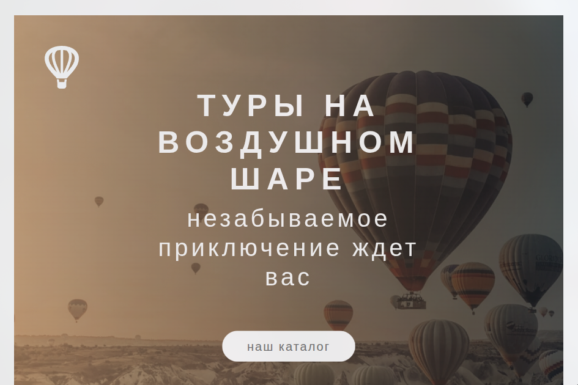

# 🎈 Landing Page - Balloon Tour

Учебный лендинг для туров на воздушном шаре. Проект на стадии разработки - реализована только hero-секция с анимациями, остальные секции ещё не вёрстаны.

---

## 🚀 Функционал

- Hero-секция с фоновым изображением и градиентным оверлеем
- `clip-path` для фигурного обрезания секции
- CSS-анимации появления заголовка и кнопки (slide-in + fade)
- Hover-эффект на кнопке с ripple-псевдоэлементом через `::after`

---

## 🛠 Стек технологий

- HTML5
- CSS3 / SCSS
- Методология: BEM
- Flexbox
- Git & GitHub

---

## 📸 Скриншоты

> 

---

## ⚙️ Запуск проекта

```bash
git clone https://github.com/xamiuez/landing-balloon-tour.git
cd landing-balloon-tour
```

**открыть `src/index.html` в браузере**

